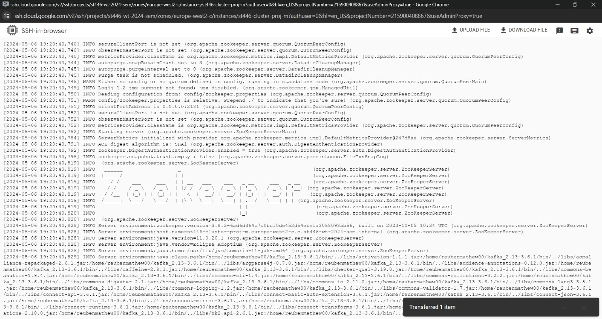
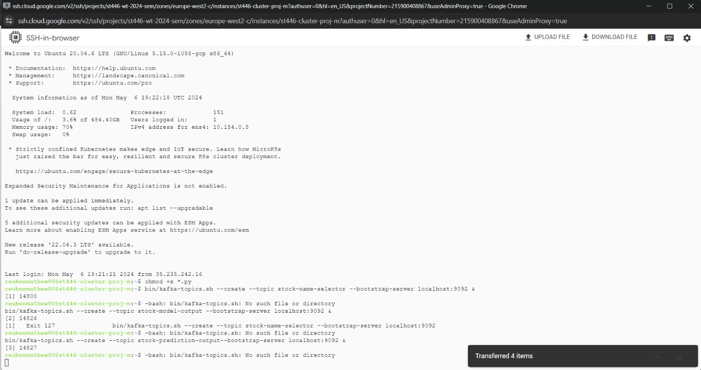
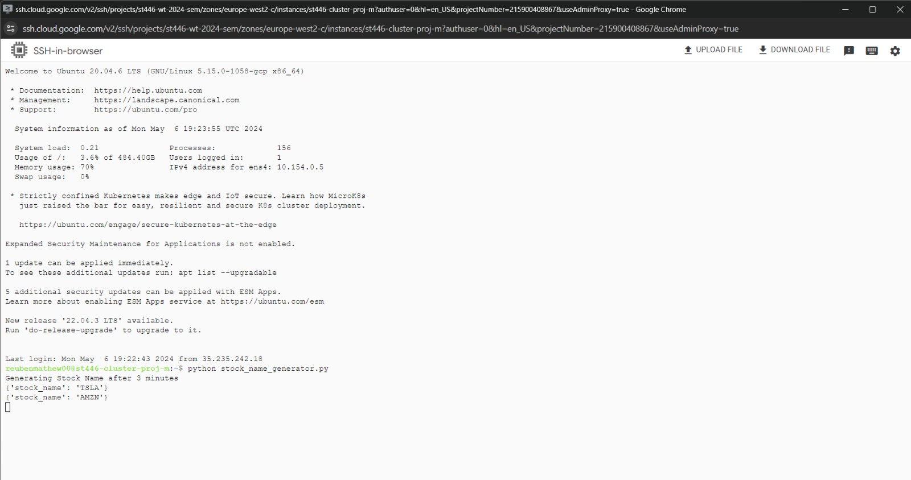
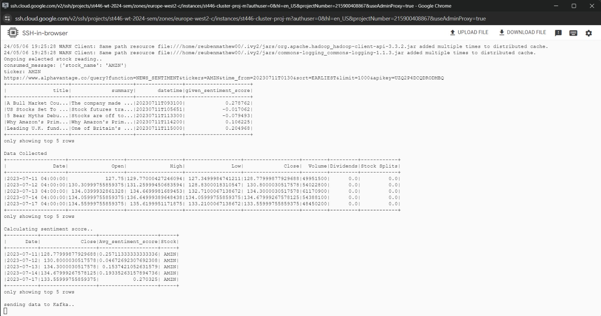
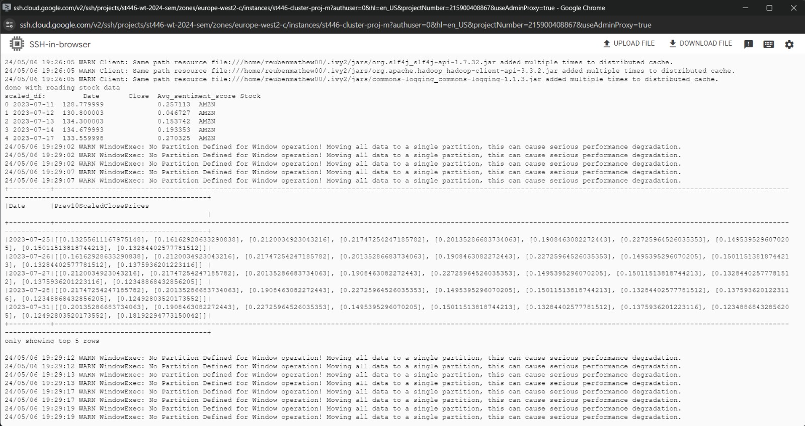
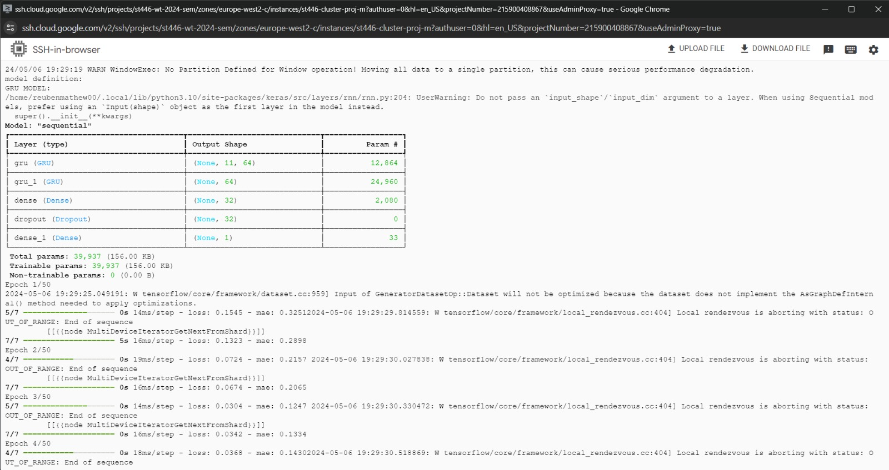
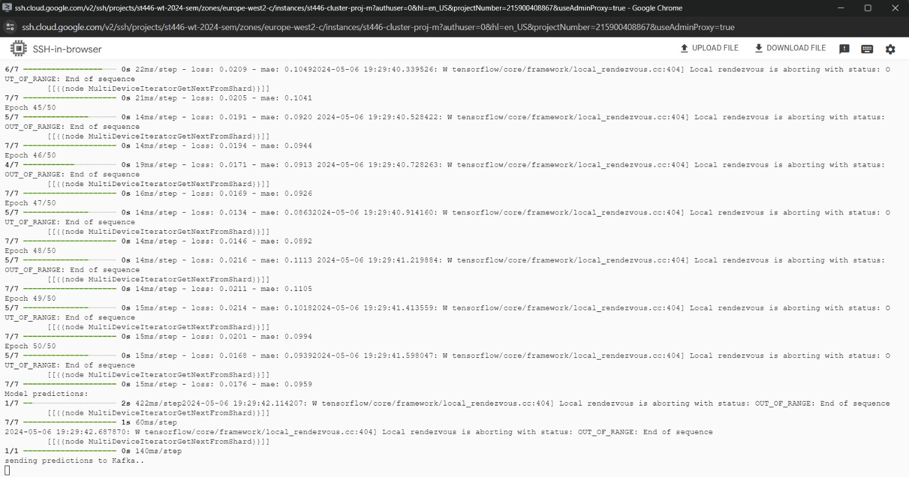
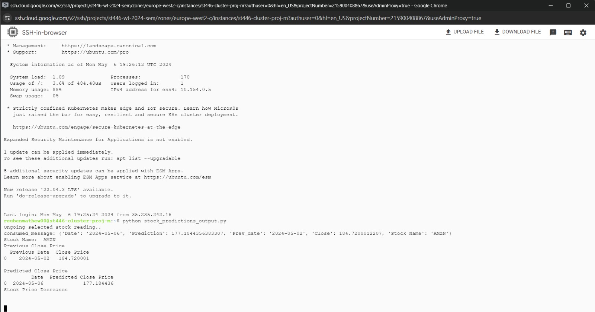

Kafka is a **distributed event streaming platform** that lets you read, write, store, and process **events** (also called records or messages in the documentation) across many machines. Example events are payment transactions, geolocation updates from mobile phones, shipping orders, sensor measurements from IoT devices or medical equipment, and much more. These events are organized and stored in **topics**. Very simplified, a topic is similar to a folder in a filesystem, and the events are the files in that folder (to probe further, see [here](https://kafka.apache.org/quickstart)).

We simulate a **real time stock prediction** based on Python, PySpark, and Kafka. The stock prediction system will generate random stock names from the top 10 stock every 3 minutes. We will capture the stock names and use Kafka to trigger events related to scraping stock and news data, pre-processing the data and then modelling the data to predict a close price for the current date, as depicted below.

* The generator will send the stock name to a producer in Kafka.
* A consumer will read the stock name and scrape the stock prices and news articles for the particular stock using Yahoo Finance and the AlphaVantage API for the past 300 days from the current date. Another producer will then send the a comprehensive dataset consisting of the close prices and the average sentiment score grouped by the date back to Kafka.
* Then, the next consumer reads the dataset and processes the data input to create a dataset to train and then fit the model to predict the close price for the current date. The predicted price is then sent to a producer in Kafka.
* Once the close price is predicted, we calculate the change in close price and predict whether the price will rise or fall.

**Action items**

1. Setting up Dataproc cluster & Apache Kafka installation/setup

##### Dataproc cluster

We spin up a cluster and perform a manual installation of Kafka. it is possible to automate the installation of libraries and other software packages during cluster instantiation through [initialisation actions](https://cloud.google.com/dataproc/docs/concepts/configuring-clusters/init-actions). However, this is not straightforward and depends on the operating system and compatibility checks for any necessary software.

* Go to **Google Cloud Console** and Activate Cloud Shell.
* `[PROJECT_ID]` should match personal project ID.
* Copy and paste the following command to get the Dataproc cluster. **Remember to change `--project` to required project ID**.

```
gcloud dataproc clusters create st446-cluster-proj --enable-component-gateway --region europe-west2 --zone europe-west2-c --master-machine-type n2-standard-2 --master-boot-disk-size 500 --num-workers 2 --worker-machine-type n2-standard-2 --worker-boot-disk-size 500 --image-version 2.1-ubuntu20 --optional-components JUPYTER --project st446-wt-2024-sem
```

##### Kafka installation

* Go to the **Dataproc tab** and click on the cluster name.
* Go to **VM INSTANCES** and **SSH** into the master node.
* We are going to **download and install Apache Kafka**. Run the following commands to get the latest Kafka version (from [here](https://archive.apache.org/dist/kafka/3.6.1/kafka_2.13-3.6.1.tgz)) and installing it on the Dataproc cluster.

 ```
 wget https://archive.apache.org/dist/kafka/3.6.1/kafka_2.13-3.6.1.tgz
 tar -xzf kafka_2.13-3.6.1.tgz
  ```

##### Additional Python packages

We need to install four additional packages (`kafka-python`, `pandas_gbq`, `yfinance` and `tensorflow`). Run the following commands to install both.

 ```
 pip install kafka-python
 pip install pandas_gbq
 pip install yfinance
 pip install tensorflow
 ```

Alternatively, we upload the [requirements.txt](./requirements.txt) file into the master node and run `pip install -r requirements.txt` to get these libraries installed.

##### Start the Kafka environment

Kafka depends on **Zookeeper**, which is a centralised service for maintaining configuration information, naming, providing distributed synchronization, and providing group services (from [here](https://zookeeper.apache.org/)). We run the following commands to start the ZooKeeper service:

```
cd kafka_2.13-3.6.1
bin/zookeeper-server-start.sh config/zookeeper.properties
```



**Open a new SSH terminal session to your master node** and run the following commands to start the Kafka broker:

```
cd kafka_2.13-3.6.1
bin/kafka-server-start.sh config/server.properties
```

Our application is comprised of 4 files: 
  * **stock_name_generator.py:** generates random stock names and sends it to a Kafka topic named `stock-name-selector`.
   
  * **stock_price_sentiment_consumer.py:**  this reads the stock name (from `stock-name-selector`) and then scrapes the stock data from Yahoo Finance and the news data from the AlphaVantage API. After scraping the data, it is pre-processed and a dataset is created and sent back to another topic (`stock-model-output`).
    
  * **stock_modeller_consumer_GRU.py:** reads the dataset from `stock-model-output` topic and feeds the data into a GRU model to predict the closing price. Then it send the close price to another topic (`stock-prediction-output`).
   
  * **stock_predictions_output.py:** reads the predicted price in `stock-prediction-output`, calculates the change in stock price and outputs whether the stock price increases or decreases.
     
2. Upload all four files into the master node and run the following command to make them executable:

```
chmod +x *.py
```

3. Create three topics:
  
```
bin/kafka-topics.sh --create --topic stock-name-selector --bootstrap-server localhost:9092 &
bin/kafka-topics.sh --create --topic stock-model-output --bootstrap-server localhost:9092 &
bin/kafka-topics.sh --create --topic stock-prediction-output --bootstrap-server localhost:9092 &
```
 


4. We need to **open four terminal sessions**, one for each application part. We need to **run the application in the following order**:

  * **[TAB 0]**: `python stock_name_generator.py`
    
   

  * **[TAB 1]**: `python stock_price_sentiment_consumer.py`
    
   
   
  * **[TAB 2]**: `python stock_modeller_consumer.py`
       
   

   

   

   
  * **[TAB 3]**: `python stock_predictions_output.py`
        
   
  

5. **CLEAN UP**: make sure to **delete your Dataproc cluster and the temp/staging folders (cloud storage)**.